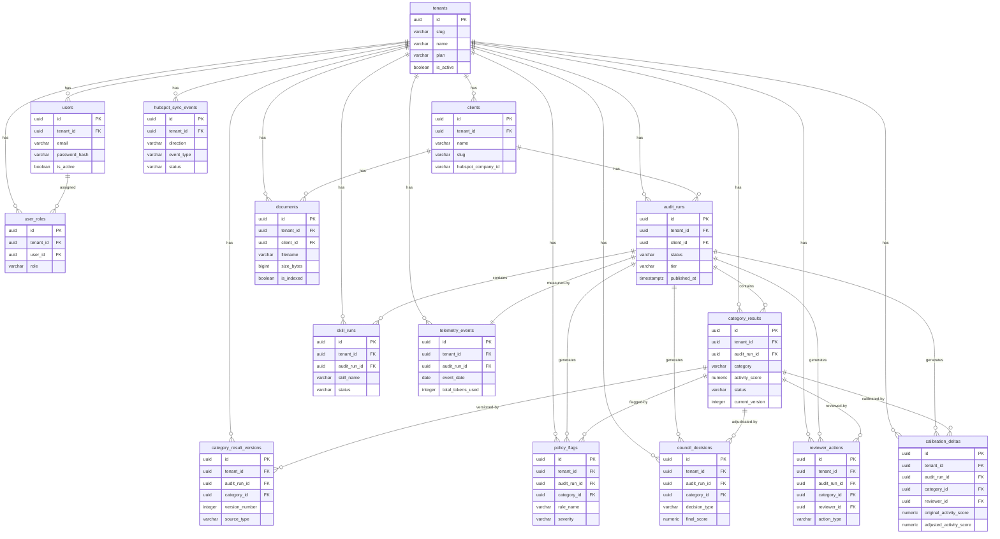

# Entity-Relationship Diagram — StrategicGlue Six-to-Fix

**Version:** 1.0  
**Author:** Neo (Backend Dev)  
**Date:** 2026-05-10  
**Status:** Locked Planning Artifact — Gates Phase 1 Coding

---

## Table: tenants

**Scope:** Shared (platform-level registry — no `tenant_id` self-referencing)

| Column | Type | Constraints |
|--------|------|-------------|
| `id` | `uuid` | PK, NOT NULL, DEFAULT gen_random_uuid() |
| `slug` | `varchar(50)` | NOT NULL, UNIQUE, CHECK (slug ~ '^[a-z0-9-]{3,50}$') |
| `name` | `varchar(100)` | NOT NULL, CHECK (length(name) >= 2) |
| `plan` | `varchar(20)` | NOT NULL, CHECK (plan IN ('starter','professional','enterprise')) |
| `is_active` | `boolean` | NOT NULL, DEFAULT true |
| `created_at` | `timestamptz` | NOT NULL, DEFAULT now() |
| `updated_at` | `timestamptz` | NOT NULL, DEFAULT now() |

**Relationships:** Referenced by all tenant-scoped tables via `tenant_id → tenants.id`.  
**Special semantics:** Root of the multi-tenant hierarchy. Deactivating a tenant (`is_active = false`) does not cascade-delete data — it gates access at the service layer.

---

## Table: users

**Scope:** Tenant-scoped (`tenant_id` present)

| Column | Type | Constraints |
|--------|------|-------------|
| `id` | `uuid` | PK, NOT NULL, DEFAULT gen_random_uuid() |
| `tenant_id` | `uuid` | NOT NULL, FK → tenants.id ON DELETE RESTRICT |
| `email` | `varchar(256)` | NOT NULL, UNIQUE |
| `normalized_email` | `varchar(256)` | NOT NULL |
| `username` | `varchar(256)` | NOT NULL |
| `normalized_username` | `varchar(256)` | NOT NULL |
| `password_hash` | `text` | NULL (nullable for external identity scenarios) |
| `security_stamp` | `text` | NOT NULL |
| `concurrency_stamp` | `text` | NOT NULL |
| `lockout_end` | `timestamptz` | NULL |
| `lockout_enabled` | `boolean` | NOT NULL, DEFAULT true |
| `access_failed_count` | `integer` | NOT NULL, DEFAULT 0 |
| `is_active` | `boolean` | NOT NULL, DEFAULT true |
| `created_at` | `timestamptz` | NOT NULL, DEFAULT now() |
| `updated_at` | `timestamptz` | NOT NULL, DEFAULT now() |

**Relationships:**
- `tenant_id → tenants.id` (RESTRICT — cannot delete tenant with users)

**Indexes:**
- `(tenant_id, id)` — composite, all tenant-scoped queries
- `normalized_email` — unique index (ASP.NET Identity requirement)

**Special semantics:** ASP.NET Core Identity user store table. `lockout_end` supports the 5-failures-in-15-min policy from auth spec.

---

## Table: user_roles

**Scope:** Tenant-scoped (users are tenant-scoped, roles are per-tenant)

| Column | Type | Constraints |
|--------|------|-------------|
| `id` | `uuid` | PK, NOT NULL, DEFAULT gen_random_uuid() |
| `tenant_id` | `uuid` | NOT NULL, FK → tenants.id ON DELETE CASCADE |
| `user_id` | `uuid` | NOT NULL, FK → users.id ON DELETE CASCADE |
| `role` | `varchar(50)` | NOT NULL, CHECK (role IN ('SuperAdmin','TenantAdmin','Reviewer','Viewer','OpsViewer')) |
| `created_at` | `timestamptz` | NOT NULL, DEFAULT now() |

**Relationships:**
- `tenant_id → tenants.id` (CASCADE)
- `user_id → users.id` (CASCADE — removing user removes their roles)

**Indexes:**
- `(tenant_id, user_id)` — composite
- `(user_id, role)` — UNIQUE (prevents duplicate role assignments)

**Special semantics:** Flat role table (no ASP.NET Identity `AspNetRoles` pattern). Roles are enumerated, not configurable at runtime.

---

## Table: clients

**Scope:** Tenant-scoped (`tenant_id` present)

| Column | Type | Constraints |
|--------|------|-------------|
| `id` | `uuid` | PK, NOT NULL, DEFAULT gen_random_uuid() |
| `tenant_id` | `uuid` | NOT NULL, FK → tenants.id ON DELETE RESTRICT |
| `name` | `varchar(200)` | NOT NULL |
| `slug` | `varchar(100)` | NOT NULL, CHECK (slug ~ '^[a-z0-9-]{1,100}$') |
| `hubspot_company_id` | `varchar(50)` | NULL |
| `industry` | `varchar(100)` | NULL |
| `website` | `varchar(500)` | NULL |
| `is_active` | `boolean` | NOT NULL, DEFAULT true |
| `created_by` | `uuid` | NOT NULL, FK → users.id ON DELETE RESTRICT |
| `created_at` | `timestamptz` | NOT NULL, DEFAULT now() |
| `updated_at` | `timestamptz` | NOT NULL, DEFAULT now() |

**Relationships:**
- `tenant_id → tenants.id` (RESTRICT)
- `created_by → users.id` (RESTRICT)

**Indexes:**
- `(tenant_id, id)` — composite
- `(tenant_id, slug)` — UNIQUE (slug unique per tenant, not globally)
- `hubspot_company_id` — for inbound webhook deduplication

**Special semantics:** HubSpot bidirectional sync — `hubspot_company_id` links to HubSpot Company object.

---

## Table: audit_runs

**Scope:** Tenant-scoped (`tenant_id` present)

| Column | Type | Constraints |
|--------|------|-------------|
| `id` | `uuid` | PK, NOT NULL, DEFAULT gen_random_uuid() |
| `tenant_id` | `uuid` | NOT NULL, FK → tenants.id ON DELETE RESTRICT |
| `client_id` | `uuid` | NOT NULL, FK → clients.id ON DELETE RESTRICT |
| `slug` | `varchar(150)` | NOT NULL |
| `status` | `varchar(30)` | NOT NULL, DEFAULT 'pending', CHECK (status IN ('pending','running','completed','published','failed')) |
| `composite_score` | `numeric(5,2)` | NULL |
| `systems_maturity_score` | `numeric(5,2)` | NULL |
| `ai_readiness_score` | `numeric(5,2)` | NULL |
| `tier` | `varchar(10)` | NULL, CHECK (tier IN ('tier_1','tier_2','tier_3')) |
| `published_at` | `timestamptz` | NULL |
| `published_by` | `uuid` | NULL, FK → users.id ON DELETE RESTRICT |
| `created_by` | `uuid` | NOT NULL, FK → users.id ON DELETE RESTRICT |
| `created_at` | `timestamptz` | NOT NULL, DEFAULT now() |
| `updated_at` | `timestamptz` | NOT NULL, DEFAULT now() |

**Relationships:**
- `tenant_id → tenants.id` (RESTRICT)
- `client_id → clients.id` (RESTRICT)
- `created_by → users.id` (RESTRICT)
- `published_by → users.id` (RESTRICT, nullable)

**Indexes:**
- `(tenant_id, id)` — composite
- `(tenant_id, client_id)` — for client audit history queries
- `(tenant_id, slug)` — UNIQUE

**Special semantics:** `status = 'published'` is a terminal state — service layer rejects all mutations except telemetry. `published_at` is set only once.

---

## Table: category_results

**Scope:** Tenant-scoped (`tenant_id` present)

| Column | Type | Constraints |
|--------|------|-------------|
| `id` | `uuid` | PK, NOT NULL, DEFAULT gen_random_uuid() |
| `tenant_id` | `uuid` | NOT NULL, FK → tenants.id ON DELETE RESTRICT |
| `audit_run_id` | `uuid` | NOT NULL, FK → audit_runs.id ON DELETE CASCADE |
| `category` | `varchar(30)` | NOT NULL, CHECK (category IN ('brand','customer','offering','communications','sales','management')) |
| `activity_score` | `numeric(4,2)` | NULL, CHECK (activity_score >= 0 AND activity_score <= 10) |
| `documented_strategy` | `varchar(10)` | NULL, CHECK (documented_strategy IN ('current','partial','none')) |
| `gap_analysis` | `text` | NULL |
| `value_driver_ratings` | `jsonb` | NULL |
| `confidence` | `numeric(4,3)` | NULL, CHECK (confidence >= 0 AND confidence <= 1) |
| `evidence` | `jsonb` | NULL |
| `status` | `varchar(20)` | NOT NULL, DEFAULT 'pending', CHECK (status IN ('pending','flagged','council_review','approved','rejected')) |
| `current_version` | `integer` | NOT NULL, DEFAULT 1 |
| `created_at` | `timestamptz` | NOT NULL, DEFAULT now() |
| `updated_at` | `timestamptz` | NOT NULL, DEFAULT now() |

**Relationships:**
- `tenant_id → tenants.id` (RESTRICT)
- `audit_run_id → audit_runs.id` (CASCADE — deleting an audit run cascades to category_results)

**Indexes:**
- `(tenant_id, audit_run_id)` — composite
- `(audit_run_id, category)` — UNIQUE (exactly one row per category per run)

**Special semantics:** Holds the *current* view of scores. `current_version` is kept in sync with `category_result_versions.version_number` via application logic. The authoritative history is in `category_result_versions`.

---

## Table: category_result_versions

**Scope:** Tenant-scoped (`tenant_id` present)

| Column | Type | Constraints |
|--------|------|-------------|
| `id` | `uuid` | PK, NOT NULL, DEFAULT gen_random_uuid() |
| `tenant_id` | `uuid` | NOT NULL, FK → tenants.id ON DELETE RESTRICT |
| `audit_run_id` | `uuid` | NOT NULL, FK → audit_runs.id ON DELETE RESTRICT |
| `category_id` | `uuid` | NOT NULL, FK → category_results.id ON DELETE RESTRICT |
| `category` | `varchar(30)` | NOT NULL |
| `version_number` | `integer` | NOT NULL |
| `activity_score` | `numeric(4,2)` | NULL |
| `documented_strategy` | `varchar(10)` | NULL |
| `gap_analysis` | `text` | NULL |
| `value_driver_ratings` | `jsonb` | NULL |
| `confidence` | `numeric(4,3)` | NULL |
| `source_type` | `varchar(20)` | NOT NULL, CHECK (source_type IN ('ai','reviewer','council')) |
| `source_id` | `uuid` | NULL |
| `created_by` | `uuid` | NOT NULL, FK → users.id ON DELETE RESTRICT |
| `created_at` | `timestamptz` | NOT NULL, DEFAULT now() |

**Relationships:**
- `tenant_id → tenants.id` (RESTRICT)
- `audit_run_id → audit_runs.id` (RESTRICT)
- `category_id → category_results.id` (RESTRICT)
- `created_by → users.id` (RESTRICT)

**Indexes:**
- `(tenant_id, audit_run_id, category_id)` — composite
- `(audit_run_id, category_id, version_number)` — UNIQUE

**Special semantics:** **APPEND-ONLY LEDGER.** Never UPDATE or DELETE. Every new score — AI initial, reviewer override, council adjustment — gets a new row with an incremented `version_number`. `source_type` identifies the originator. Application code enforces immutability (sf_app role has INSERT only on this table).

---

## Table: skill_runs

**Scope:** Tenant-scoped (`tenant_id` present)

| Column | Type | Constraints |
|--------|------|-------------|
| `id` | `uuid` | PK, NOT NULL, DEFAULT gen_random_uuid() |
| `tenant_id` | `uuid` | NOT NULL, FK → tenants.id ON DELETE RESTRICT |
| `audit_run_id` | `uuid` | NOT NULL, FK → audit_runs.id ON DELETE CASCADE |
| `skill_name` | `varchar(100)` | NOT NULL |
| `skill_version` | `varchar(20)` | NOT NULL |
| `skill_index` | `integer` | NOT NULL, CHECK (skill_index >= 0 AND skill_index <= 4) |
| `status` | `varchar(20)` | NOT NULL, DEFAULT 'pending', CHECK (status IN ('pending','running','completed','failed','stale')) |
| `input_hash` | `varchar(64)` | NULL |
| `output_json` | `jsonb` | NULL |
| `tokens_used` | `integer` | NULL |
| `latency_ms` | `integer` | NULL |
| `failure_reason` | `text` | NULL |
| `started_at` | `timestamptz` | NULL |
| `completed_at` | `timestamptz` | NULL |
| `created_at` | `timestamptz` | NOT NULL, DEFAULT now() |

**Relationships:**
- `tenant_id → tenants.id` (RESTRICT)
- `audit_run_id → audit_runs.id` (CASCADE)

**Indexes:**
- `(tenant_id, audit_run_id)` — composite
- `(audit_run_id, skill_name)` — for querying latest run of a given skill
- `input_hash` — for deduplication / cache lookup

**Special semantics:** `status = 'stale'` marks downstream skills invalidated by a reviewer-triggered rerun. One row per skill execution; reruns create a new row rather than overwriting the existing one.

---

## Table: policy_flags

**Scope:** Tenant-scoped (`tenant_id` present)

| Column | Type | Constraints |
|--------|------|-------------|
| `id` | `uuid` | PK, NOT NULL, DEFAULT gen_random_uuid() |
| `tenant_id` | `uuid` | NOT NULL, FK → tenants.id ON DELETE RESTRICT |
| `audit_run_id` | `uuid` | NOT NULL, FK → audit_runs.id ON DELETE CASCADE |
| `category_id` | `uuid` | NOT NULL, FK → category_results.id ON DELETE CASCADE |
| `rule_name` | `varchar(50)` | NOT NULL, CHECK (rule_name IN ('LOW_CONFIDENCE','MISSING_EVIDENCE','BENCHMARK_OUTLIER','INSUFFICIENT_EVIDENCE','SCORE_STRATEGY_MISMATCH')) |
| `severity` | `varchar(10)` | NOT NULL, CHECK (severity IN ('warning','trigger')) |
| `detail` | `jsonb` | NULL |
| `created_at` | `timestamptz` | NOT NULL, DEFAULT now() |

**Relationships:**
- `tenant_id → tenants.id` (RESTRICT)
- `audit_run_id → audit_runs.id` (CASCADE)
- `category_id → category_results.id` (CASCADE)

**Indexes:**
- `(tenant_id, audit_run_id)` — composite
- `(audit_run_id, category_id)` — for fetching flags per category

**Special semantics:** Multiple policy flags may exist per category per audit run (a category can trigger multiple rules simultaneously). `severity = 'trigger'` flags cause automatic escalation to the AI Council.

---

## Table: council_decisions

**Scope:** Tenant-scoped (`tenant_id` present)

| Column | Type | Constraints |
|--------|------|-------------|
| `id` | `uuid` | PK, NOT NULL, DEFAULT gen_random_uuid() |
| `tenant_id` | `uuid` | NOT NULL, FK → tenants.id ON DELETE RESTRICT |
| `audit_run_id` | `uuid` | NOT NULL, FK → audit_runs.id ON DELETE CASCADE |
| `category_id` | `uuid` | NOT NULL, FK → category_results.id ON DELETE CASCADE |
| `decision_type` | `varchar(20)` | NOT NULL, CHECK (decision_type IN ('confirmed','adjusted')) |
| `original_score` | `numeric(4,2)` | NOT NULL |
| `final_score` | `numeric(4,2)` | NOT NULL |
| `rationale` | `text` | NOT NULL |
| `advocate_output` | `jsonb` | NULL |
| `skeptic_output` | `jsonb` | NULL |
| `judge_output` | `jsonb` | NULL |
| `triggered_by` | `varchar(50)` | NULL |
| `created_at` | `timestamptz` | NOT NULL, DEFAULT now() |

**Relationships:**
- `tenant_id → tenants.id` (RESTRICT)
- `audit_run_id → audit_runs.id` (CASCADE)
- `category_id → category_results.id` (CASCADE)

**Indexes:**
- `(tenant_id, audit_run_id)` — composite
- `(audit_run_id, category_id)` — for fetching council decision per category

**Special semantics:** At most one active council decision per (audit_run_id, category_id). Council-adjusted scores become the input to the reviewer queue via a new `category_result_versions` entry with `source_type = 'council'`.

---

## Table: reviewer_actions

**Scope:** Tenant-scoped (`tenant_id` present)

| Column | Type | Constraints |
|--------|------|-------------|
| `id` | `uuid` | PK, NOT NULL, DEFAULT gen_random_uuid() |
| `tenant_id` | `uuid` | NOT NULL, FK → tenants.id ON DELETE RESTRICT |
| `audit_run_id` | `uuid` | NOT NULL, FK → audit_runs.id ON DELETE CASCADE |
| `category_id` | `uuid` | NOT NULL, FK → category_results.id ON DELETE CASCADE |
| `reviewer_id` | `uuid` | NOT NULL, FK → users.id ON DELETE RESTRICT |
| `action_type` | `varchar(20)` | NOT NULL, CHECK (action_type IN ('approve','reject','edit','rerun','escalate')) |
| `notes` | `text` | NULL |
| `override_reason_code` | `varchar(50)` | NULL |
| `created_at` | `timestamptz` | NOT NULL, DEFAULT now() |

**Relationships:**
- `tenant_id → tenants.id` (RESTRICT)
- `audit_run_id → audit_runs.id` (CASCADE)
- `category_id → category_results.id` (CASCADE)
- `reviewer_id → users.id` (RESTRICT)

**Indexes:**
- `(tenant_id, audit_run_id, category_id, reviewer_id)` — composite (lockout query)
- `(audit_run_id, category_id, action_type, created_at)` — for rejection-count window query

**Special semantics:** Append-only audit log of all reviewer actions. The lockout check queries this table: `COUNT(*) WHERE action_type = 'reject' AND reviewer_id = :id AND (tenant_id, audit_run_id, category_id) = (:t,:r,:c) AND created_at > NOW() - INTERVAL '24 hours' >= 3`.

---

## Table: calibration_deltas

**Scope:** Tenant-scoped (`tenant_id` present)

| Column | Type | Constraints |
|--------|------|-------------|
| `id` | `uuid` | PK, NOT NULL, DEFAULT gen_random_uuid() |
| `tenant_id` | `uuid` | NOT NULL, FK → tenants.id ON DELETE RESTRICT |
| `audit_run_id` | `uuid` | NOT NULL, FK → audit_runs.id ON DELETE CASCADE |
| `category_id` | `uuid` | NOT NULL, FK → category_results.id ON DELETE CASCADE |
| `reviewer_id` | `uuid` | NOT NULL, FK → users.id ON DELETE RESTRICT |
| `original_activity_score` | `numeric(4,2)` | NOT NULL |
| `adjusted_activity_score` | `numeric(4,2)` | NOT NULL |
| `original_documented_strategy` | `varchar(10)` | NULL |
| `adjusted_documented_strategy` | `varchar(10)` | NULL |
| `override_reason_code` | `varchar(50)` | NOT NULL |
| `notes` | `text` | NOT NULL |
| `created_at` | `timestamptz` | NOT NULL, DEFAULT now() |

**Relationships:**
- `tenant_id → tenants.id` (RESTRICT)
- `audit_run_id → audit_runs.id` (CASCADE)
- `category_id → category_results.id` (CASCADE)
- `reviewer_id → users.id` (RESTRICT)

**Indexes:**
- `(tenant_id, audit_run_id)` — composite
- `(reviewer_id, created_at)` — for calibration dashboard queries

**Special semantics:** Created on **every** reviewer score override — no exceptions. This is the model improvement signal. `override_reason_code` and non-empty `notes` are both required (enforced at service layer before INSERT).

---

## Table: documents

**Scope:** Tenant-scoped (`tenant_id` present)

| Column | Type | Constraints |
|--------|------|-------------|
| `id` | `uuid` | PK, NOT NULL, DEFAULT gen_random_uuid() |
| `tenant_id` | `uuid` | NOT NULL, FK → tenants.id ON DELETE RESTRICT |
| `client_id` | `uuid` | NOT NULL, FK → clients.id ON DELETE CASCADE |
| `filename` | `varchar(500)` | NOT NULL |
| `content_type` | `varchar(100)` | NOT NULL |
| `size_bytes` | `bigint` | NOT NULL, CHECK (size_bytes > 0 AND size_bytes <= 10485760) |
| `blob_path` | `text` | NOT NULL |
| `blob_container` | `varchar(100)` | NOT NULL |
| `search_index_id` | `varchar(200)` | NULL |
| `is_indexed` | `boolean` | NOT NULL, DEFAULT false |
| `indexed_at` | `timestamptz` | NULL |
| `uploaded_by` | `uuid` | NOT NULL, FK → users.id ON DELETE RESTRICT |
| `created_at` | `timestamptz` | NOT NULL, DEFAULT now() |

**Relationships:**
- `tenant_id → tenants.id` (RESTRICT)
- `client_id → clients.id` (CASCADE — deleting a client cascades to their documents)
- `uploaded_by → users.id` (RESTRICT)

**Indexes:**
- `(tenant_id, client_id)` — composite
- `search_index_id` — for AI Search reference lookups

**Special semantics:** `size_bytes <= 10485760` enforces the 10MB upload limit in the DB as a defense-in-depth check (primary check is in API layer). `is_indexed` and `indexed_at` track Azure AI Search indexing state (SLA: within 30 seconds of upload).

---

## Table: hubspot_sync_events

**Scope:** Tenant-scoped (`tenant_id` present, NULL for platform-level inbound events without a matched tenant)

| Column | Type | Constraints |
|--------|------|-------------|
| `id` | `uuid` | PK, NOT NULL, DEFAULT gen_random_uuid() |
| `tenant_id` | `uuid` | NULL, FK → tenants.id ON DELETE SET NULL |
| `direction` | `varchar(10)` | NOT NULL, CHECK (direction IN ('inbound','outbound')) |
| `event_type` | `varchar(100)` | NOT NULL |
| `hubspot_portal_id` | `varchar(50)` | NULL |
| `hubspot_subscription_id` | `varchar(50)` | NULL |
| `occurred_at` | `timestamptz` | NULL |
| `payload` | `jsonb` | NULL |
| `status` | `varchar(20)` | NOT NULL, DEFAULT 'received', CHECK (status IN ('received','processed','failed','duplicate')) |
| `error_detail` | `text` | NULL |
| `audit_run_id` | `uuid` | NULL, FK → audit_runs.id ON DELETE SET NULL |
| `client_id` | `uuid` | NULL, FK → clients.id ON DELETE SET NULL |
| `created_at` | `timestamptz` | NOT NULL, DEFAULT now() |
| `processed_at` | `timestamptz` | NULL |

**Relationships:**
- `tenant_id → tenants.id` (SET NULL — inbound events may arrive before tenant is matched)
- `audit_run_id → audit_runs.id` (SET NULL)
- `client_id → clients.id` (SET NULL)

**Indexes:**
- `(tenant_id, created_at)` — composite
- `(hubspot_portal_id, hubspot_subscription_id, occurred_at)` — UNIQUE WHERE status != 'duplicate' (deduplication key)

**Special semantics:** Inbound events are processed asynchronously via `Channel<HubSpotEvent>` background worker. Outbound events are written when a published audit triggers a HubSpot push. Deduplication is by `(portal_id, subscription_id, occurred_at)` composite.

---

## Table: telemetry_events

**Scope:** Tenant-scoped (`tenant_id` present)

| Column | Type | Constraints |
|--------|------|-------------|
| `id` | `uuid` | PK, NOT NULL, DEFAULT gen_random_uuid() |
| `tenant_id` | `uuid` | NOT NULL, FK → tenants.id ON DELETE RESTRICT |
| `audit_run_id` | `uuid` | NOT NULL, FK → audit_runs.id ON DELETE CASCADE |
| `event_date` | `date` | NOT NULL, DEFAULT CURRENT_DATE |
| `total_tokens_used` | `integer` | NOT NULL, DEFAULT 0 |
| `total_latency_ms` | `integer` | NOT NULL, DEFAULT 0 |
| `skill_run_count` | `integer` | NOT NULL, DEFAULT 0 |
| `policy_trigger_count` | `integer` | NOT NULL, DEFAULT 0 |
| `council_run_count` | `integer` | NOT NULL, DEFAULT 0 |
| `reviewer_action_count` | `integer` | NOT NULL, DEFAULT 0 |
| `completed_at` | `timestamptz` | NULL |
| `created_at` | `timestamptz` | NOT NULL, DEFAULT now() |

**Relationships:**
- `tenant_id → tenants.id` (RESTRICT)
- `audit_run_id → audit_runs.id` (CASCADE)

**Indexes:**
- `(tenant_id, event_date)` — composite (daily metrics query)
- `(audit_run_id)` — UNIQUE (one telemetry record per audit run)

**Special semantics:** One row per completed audit run. Updated in real-time as the run progresses; finalized when the run completes. Powers the `/api/ops/metrics/daily` endpoint.

---

## Mermaid ERD (Structural Overview)

---

## Tenant-Scoped vs Shared Table Summary

| Table | Tenant-Scoped | Notes |
|-------|:---:|-------|
| `tenants` | ❌ | Platform registry — the root anchor |
| `users` | ✅ | `tenant_id` NOT NULL FK |
| `user_roles` | ✅ | `tenant_id` NOT NULL FK |
| `clients` | ✅ | `tenant_id` NOT NULL FK |
| `audit_runs` | ✅ | `tenant_id` NOT NULL FK |
| `category_results` | ✅ | `tenant_id` NOT NULL FK |
| `category_result_versions` | ✅ | `tenant_id` NOT NULL FK |
| `skill_runs` | ✅ | `tenant_id` NOT NULL FK |
| `policy_flags` | ✅ | `tenant_id` NOT NULL FK |
| `council_decisions` | ✅ | `tenant_id` NOT NULL FK |
| `reviewer_actions` | ✅ | `tenant_id` NOT NULL FK |
| `calibration_deltas` | ✅ | `tenant_id` NOT NULL FK |
| `documents` | ✅ | `tenant_id` NOT NULL FK |
| `hubspot_sync_events` | ✅* | `tenant_id` nullable (inbound pre-match) |
| `telemetry_events` | ✅ | `tenant_id` NOT NULL FK |

*`hubspot_sync_events.tenant_id` is nullable specifically to support inbound webhook events that arrive before a tenant can be resolved. EF Core global query filter on this table uses `tenant_id IS NULL OR tenant_id = :tenantId` for reads, and always sets `tenant_id` for app-initiated writes.
